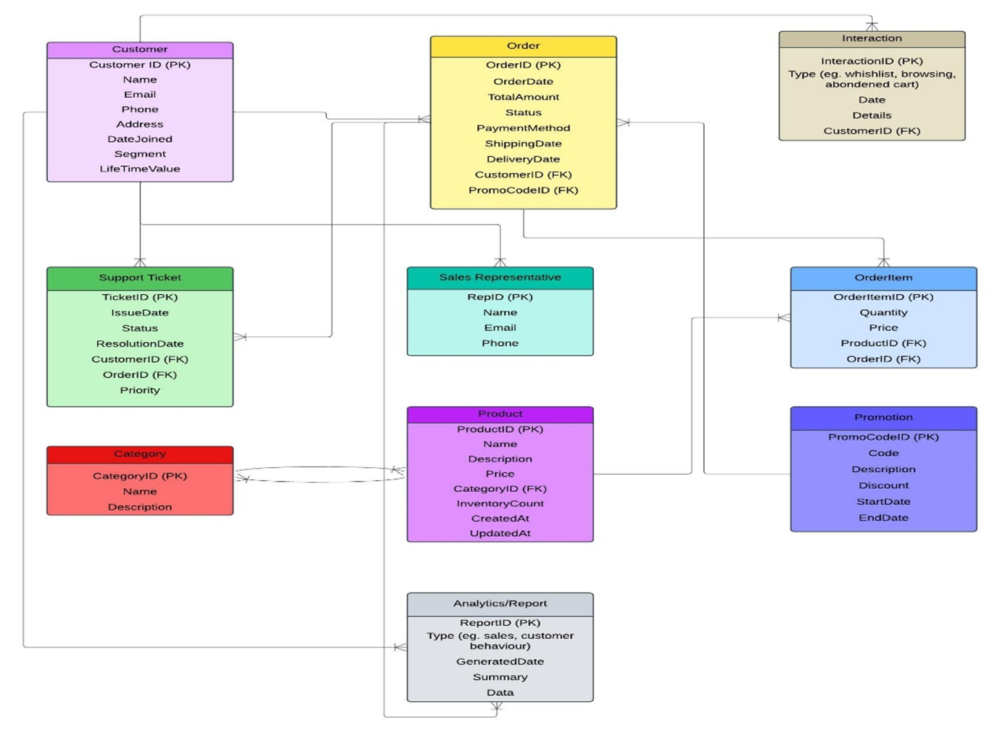
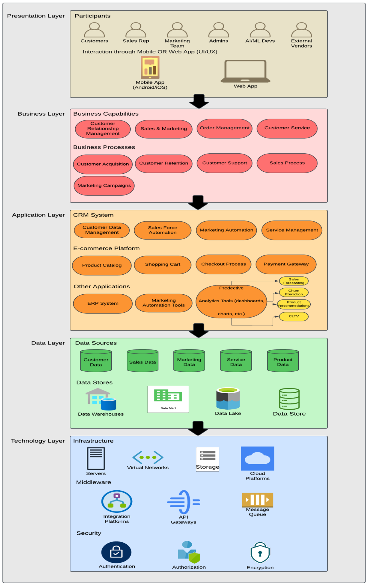
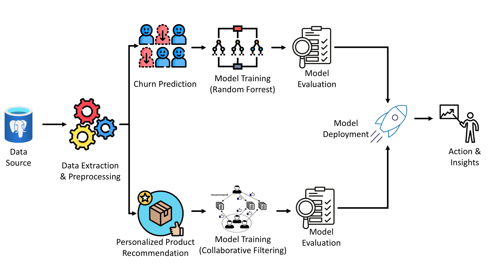
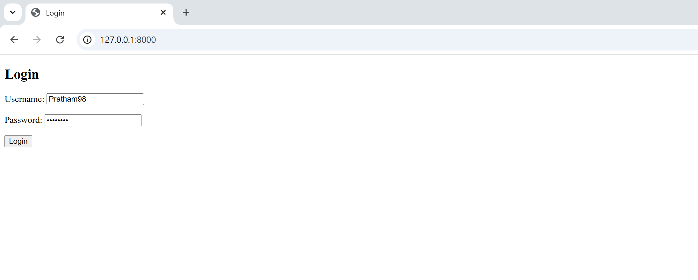
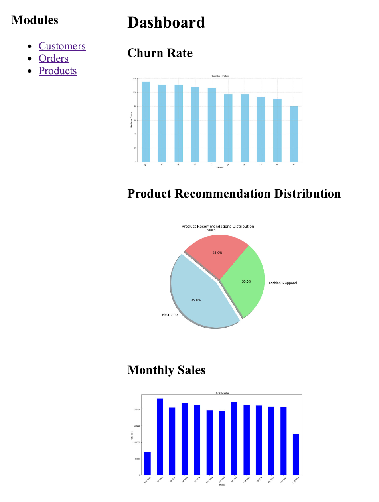
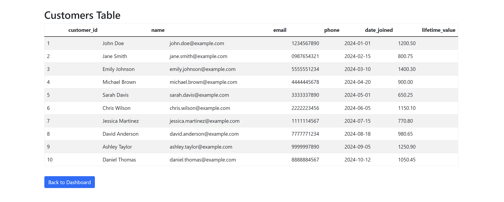
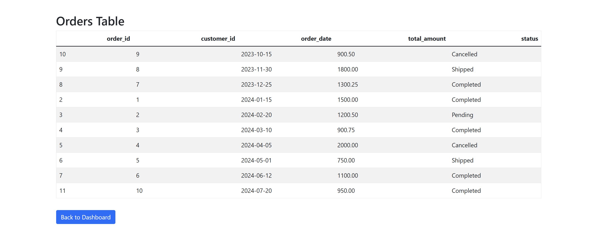
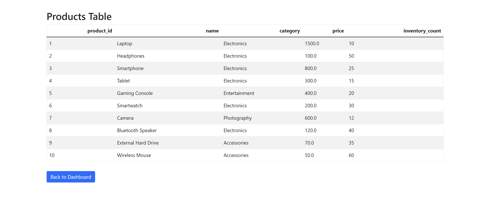

# Enterprise CRM for E-commerce

## Project Overview
This project focuses on developing an Enterprise Customer Relationship Management (CRM) system tailored for e-commerce businesses. The CRM is designed to centralize customer data, manage sales records, track customer interactions, and provide analytics on customer behavior, enhancing customer retention, improving support efficiency, and personalizing marketing efforts.

## ER Diagram
The project started with the development of a comprehensive Entity-Relationship (ER) diagram that outlines all the primary entities and their relationships within the CRM system. The ER diagram serves as a blueprint for the database design, ensuring that all data interactions are logically structured and efficiently managed.



## Enterprise Data Architecture (EDA)

The Enterprise Data Architecture for this CRM system is designed to support scalability, reliability, and performance in handling large volumes of data both structured and unstructured. The architecture is layered as follows:
### Presentation Layer
Serves as the front end where users interact with the CRM through web and mobile interfaces.

### Business Layer
Handles business logic and processes data according to the operational requirements of the e-commerce business.

### Application Layer
Includes all the application logic necessary to perform transaction processing and analytics.

### Data Layer
Manages the storage and retrieval of data across multiple storage systems, from traditional databases to cloud-based storage solutions.

### Technology Layer
Provides the necessary technical infrastructure such as servers, network equipment, and software platforms that support the above layers.

## Business Workflow Model


## Data Lake Creation and Physical Database Design

### Data Lake Creation in PostgreSQL

The foundation of our Enterprise CRM system is a robust data lake built within PostgreSQL, designed to consolidate and manage both structured and unstructured data crucial for comprehensive analytics. The logical schema of the data lake was meticulously crafted to support a wide range of data types from various sources, enabling deep insights into e-commerce business operations.

- **Logical Schema Design**: We developed a logical schema that serves as a blueprint for storing structured data such as customer profiles, order histories, and product information, alongside unstructured data like customer reviews and market trends. This schema is specifically optimized for flexibility and scalability to accommodate the evolving needs of data storage and retrieval.

- **Data Integration**: The data lake integrates data from multiple sources, ensuring that all relevant data streams are captured and stored efficiently. This integration facilitates the seamless flow of information across the CRM system, supporting dynamic data analysis and decision-making.

### Physical Database Design

Building upon the logical schema, the physical database design was implemented to enhance performance and ensure data integrity. Key techniques used in this phase include:

- **Indexing**: To improve query performance, especially for frequently accessed data fields, we implemented strategic indexing. For example:
  ```sql
  CREATE INDEX idx_customer_id ON orders(customer_id);
  CREATE INDEX idx_order_date_status ON orders(order_date, status);


## Features
- **Customer Profile Management:** Organize and manage customer information including contact details, preferences, and transaction history.
- **Sales and Marketing Analytics:** Tools for segmenting customer data for targeted campaigns and analyzing sales data to tailor offers.
- **Customer Support and Tracking:** Manage and log support interactions to efficiently resolve issues and maintain quality service.
- **Loyalty Program Management:** Utilize customer data to identify loyal customers and offer targeted incentives.

## Technologies Used
- **Django**: For building the web application.
- **PostgreSQL**: As the backend database.
- **Django ORM**: For database interactions.
- **Python**: Primary programming language.
- **JavaScript/HTML/CSS**: For frontend development.
- **Azure**: Intended cloud platform for deployment (not implemented due to budget constraints).

## Installation
To set up the project locally, follow these steps:

1. **Clone the Repository**
git clone https://github.com/yourusername/project-repository.git 
cd project-repository

2. **Set Up a Virtual Environment** (Optional but recommended)
python -m venv venv source venv/bin/activate # On Windows use venv\Scripts\activate

3. **Install Dependencies**
pip install -r requirements.txt

4. **Database Setup**
- Make sure PostgreSQL is installed and running.
- Create a database named `ecommerce_data_lake`.
- Update the `DATABASES` configuration in `settings.py` with your database credentials.

5. **Run Migrations**
python manage.py makemigrations 
python manage.py migrate

6. **Start the Development Server**
python manage.py runserver

7. **Visit the Application**
- Open a browser and go to `http://localhost:8000` to start using the application.

## Screenshots

Below are screenshots from the CRM system, showcasing the intuitive user interface and key functionalities:

### Login Page



### Dashboard
This view displays an overview of key performance metrics and insights.


### Customer Table
View and manage customer information effectively.


### Orders Table
Track and analyze customer orders with ease.


### Products Table
Manage product inventory and details.


## License
Distributed under the MIT License. See `LICENSE` for more information.

## Contact
- **Prathamesh Kandpal** - [plk7197@nyu.edu](mailto:plk7197@nyu.edu)
- Project Link: [https://github.com/yourusername/project-repository](https://github.com/yourusername/project-repository)

## Acknowledgements
- [Django Documentation](https://docs.djangoproject.com/en/3.1/)
- [PostgreSQL Documentation](https://www.postgresql.org/docs/)
- [Under the guidance of Prof. Jean Claude Franchitti - NYU Courant]
